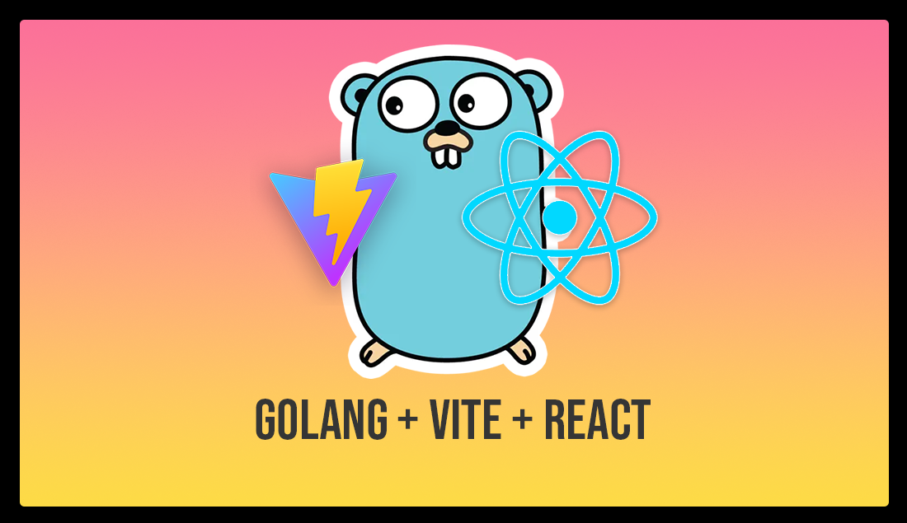
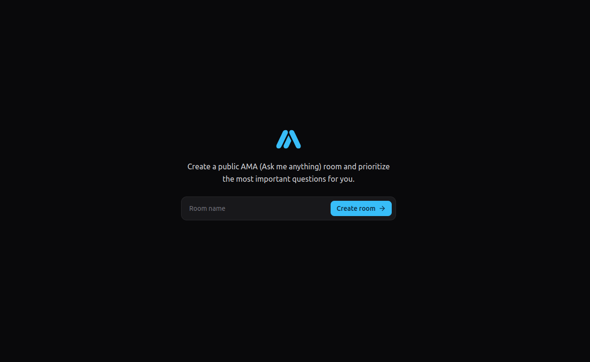
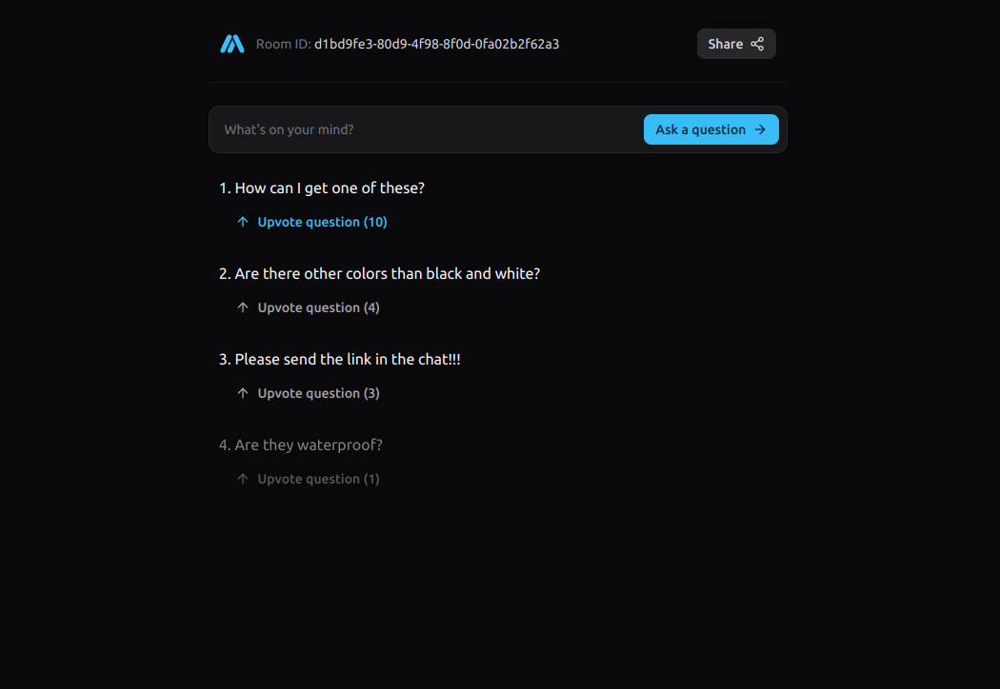

# React GAMA Application




Welcome to the React Go-AMA (Ask Me Anything) application! This project is built using React and Vite, providing a fast and modern development experience.

## Table of Contents

- [Introduction](#introduction)
- [Features](#features)
- [Installation](#installation)
- [Usage](#usage)
- [Contributing](#contributing)
- [License](#license)

## Introduction

The React GAMA application allows users to create and participate in "Ask Me Anything" sessions. Users can post questions, and the host can answer them in real-time. This application is perfect for live Q&A sessions, webinars, and interactive discussions.

## Features

- **Real-time Q&A:** Users can post questions, upvote the ones they want to know the answer, and get answers in real-time.
- **Responsive Design:** Works seamlessly on both desktop and mobile devices.

## Installation

To get started with the React AMA application, follow these steps:

1. **Clone the repository:**

   ```bash
   git clone https://github.com/CaioDGallo/react-ama.git
   cd react-ama
   ```

2. **Install dependencies:**

   ```bash
   npm install
   ```

3. **Start the development server:**

   ```bash
   npm run dev
   ```

4. **Open your browser and navigate to:**

   ```
   http://localhost:5173
   ```

## Usage

Once the application is up and running, you can start creating and participating in AMA sessions. Here are some basic steps:

1. **Create a room:** Enter a room name and click on the "Create Room" button.


2. **Share the room link:** Copy the room link and share it with your audience.
3. **Post Questions:** Users can post questions and upvote the ones they want to know the answer.


4. **Join the room:** Users can join the room using the shared link.
5. **Upvote Questions:** Users can upvote questions by clicking on the "Upvote" button.

## License

This project is licensed under the MIT License. See the [LICENSE](LICENSE) file for more details.

---

Thank you for checking out the React GAMA application! If you have any questions or need further assistance, feel free to reach out.
